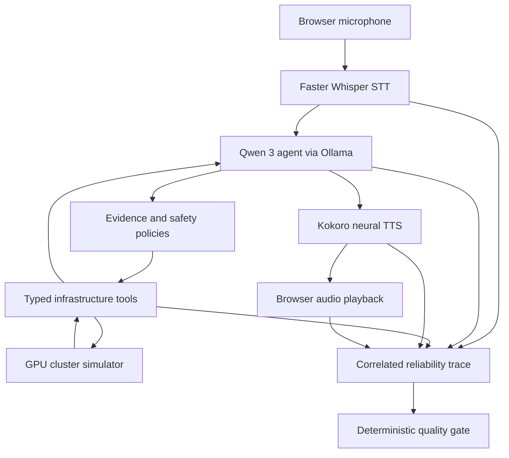

# SentinelVoice Reliability Lab

**A local-first Voice AI reliability and incident-response platform for testing evidence-grounded, tool-using agents.**

SentinelVoice combines an interactive Voice AI SRE with structured tracing, deterministic safety controls, and automated quality gates. The reference agent investigates incidents in a repeatable eight-node GPU-inference simulator, recommends recovery actions, requires explicit approval for high-impact operations, executes approved remediation, and verifies whether the system recovered.

> **Project status:** Active development. The current release is a working local prototype backed by a deterministic infrastructure simulator. It is not connected to production infrastructure.

## Why SentinelVoice?

Voice agents that call tools must do more than produce convincing responses. They must select the correct tools, use valid arguments, ground conclusions in returned evidence, handle delays and failures, protect dangerous actions, and remain responsive during spoken interaction.

SentinelVoice provides a controlled environment for building and evaluating those behaviors. The GPU incident commander is the reference application; the longer-term goal is a reusable reliability framework for compatible voice agents.

## Current capabilities

- Browser microphone capture and local speech transcription with Faster Whisper
- Multi-step reasoning with Qwen 3 through Ollama
- Typed infrastructure tools with structured evidence
- Deterministic eight-node GPU-inference simulator
- Thermal-failure and traffic-spike scenarios
- Mandatory evidence collection before incident diagnosis
- Risk-ranked remediation recommendations
- Unsafe hot-node restart prevention
- Expiring, action-bound confirmation tokens
- Exact spoken confirmation and cancellation
- Replay and stale-state protection
- Simulated recovery execution and post-action verification
- Neural speech generation with Kokoro TTS
- Playback interruption when the user starts recording
- Correlated STT, LLM, tool, TTS, orchestration, and playback traces
- Deterministic latency evaluation and PASS/FAIL/INCOMPLETE quality gates
- React dashboard for telemetry, evidence, remediation, traces, and evaluations
- Automated backend tests for investigation, safety, recovery, tracing, and evaluation

## Example incident

SentinelVoice can inject a repeatable thermal failure in `gpu-node-03`:

| Signal | Healthy baseline | During incident | After remediation |
|---|---:|---:|---:|
| Healthy nodes | 8/8 | 7/8 | 7/8 + node quarantined |
| Node 03 temperature | 70°C | 96°C | Quarantined |
| Time to first token | 420 ms | 2,840 ms | 540 ms |
| Queue depth | 12 | 146 | 24 |
| Error rate | 0.8% | 8.7% | 1.1% |

The agent collects cluster, inference, and node-health evidence before identifying the probable root cause. It blocks restarting the failed node while it remains at an unsafe temperature and recommends draining and redistributing its workloads instead.

All values above come from the deterministic simulator and must not be interpreted as measurements from physical GPUs.

## Architecture



## Safety model

The LLM does not receive shell access or unrestricted infrastructure credentials. It can request only registered, typed tools.

| Operation | Example | Policy |
|---|---|---|
| Read-only | Inspect metrics or node health | Automatically allowed and traced |
| Preparation | Create a remediation proposal | Validated against current state |
| High impact | Drain or redistribute workloads | Explicit action-specific confirmation required |
| Unsafe | Restart a node at 96°C | Blocked by deterministic policy |

Confirmations are bound to one exact action, valid for two minutes, invalidated when cluster state changes, single-use, replay-protected, and rejected when the spoken phrase is vague or incorrect.

## Reliability tracing and evaluation

Every interaction can share one trace ID across the complete pipeline:

```text
transcription
turn_started
tool_call
llm_decision
turn_completed
speech_generation
playback_started
playback_completed | playback_interrupted
```

The evaluator reports STT latency, total LLM latency, tool latency, agent-processing latency, TTS generation latency, time to first audio, and interruption latency when measurable.

Each metric contains its measured value, threshold, status, explanation, and supporting event IDs. Critical violations fail the quality gate; missing critical telemetry produces an incomplete result rather than a misleading pass.

### Initial local baseline

One development run on an Apple M3 Pro produced:

| Component | Observed latency |
|---|---:|
| Faster Whisper STT | 429 ms |
| Infrastructure tools | 6.7 ms |
| Qwen 3 14B reasoning | 40.1 s |
| Kokoro batch generation | 10.8 s |

These measurements establish a baseline, not a performance claim. They reveal that model reasoning and batch speech generation are the current bottlenecks and motivate the planned benchmark and streaming work.

## Technology stack

| Layer | Technology |
|---|---|
| Backend | Python 3.12, FastAPI, Pydantic, HTTPX |
| Frontend | React, TypeScript, Vite |
| Speech recognition | Faster Whisper |
| Language model | Qwen 3 through Ollama |
| Speech synthesis | Kokoro 82M |
| Voice activity | Silero VAD dependency; continuous integration planned |
| Testing | Pytest |
| Observability | Correlated structured events and deterministic evaluators |
| Infrastructure | Deterministic GPU-inference simulator |

## Prerequisites

The tested local configuration uses macOS on Apple Silicon, Python 3.12, Node.js 22, Ollama, `espeak-ng`, and at least 16 GB unified memory for the default Qwen 3 14B model.

Smaller Ollama models may be used on systems with less memory, but tool-selection quality and latency should be evaluated separately.

## Local setup

### 1. Install system dependencies

Install and start [Ollama](https://ollama.com/), then download the default model:

```bash
ollama pull qwen3:14b
```

On macOS with Homebrew:

```bash
brew install espeak-ng
```

### 2. Start the backend

```bash
cd backend
python3.12 -m venv .venv
source .venv/bin/activate
python -m pip install --upgrade pip
python -m pip install -e ".[voice,dev]"

export OLLAMA_MODEL=qwen3:14b
export PYTORCH_ENABLE_MPS_FALLBACK=1

uvicorn sentinelvoice.main:app --reload
```

The backend is available at `http://localhost:8000`; health and OpenAPI endpoints are `/health` and `/docs`. Faster Whisper and Kokoro may download model files during first use.

### 3. Start the frontend

In a second terminal:

```bash
cd frontend
nvm use 22
npm install
npm run dev
```

Open `http://localhost:5173` in Chrome and grant microphone permission.

## Run the tests

```bash
cd backend
source .venv/bin/activate
pytest
```

The suite covers simulator behavior, structured evidence, investigation completeness, unsafe-action blocking, confirmation binding, replay prevention, recovery verification, trace correlation, reliability evaluation, and quality-gate behavior.

Build the frontend before publishing changes:

```bash
cd frontend
npm run build
```

## Demo workflow

1. Inject a thermal failure.
2. Record an investigation request.
3. Review and submit the transcript.
4. Inspect the evidence and diagnosis.
5. Verify that restarting the overheated node is blocked.
6. Prepare the recommended drain-and-redistribute action.
7. Speak the exact confirmation phrase or use the explicit button.
8. Verify the recovered metrics and quarantined node.
9. Inspect the trace timeline and quality-gate results.

## Configuration

| Variable | Default | Purpose |
|---|---|---|
| `OLLAMA_MODEL` | `qwen2.5:3b` | Ollama model requested by the backend |
| `OLLAMA_URL` | `http://localhost:11434` | Ollama API base URL |
| `WHISPER_MODEL` | `tiny.en` | Faster Whisper model |
| `KOKORO_VOICE` | `af_heart` | Kokoro voice |
| `VAD_THRESHOLD` | `0.55` | Reserved for Silero VAD integration |
| `PYTORCH_ENABLE_MPS_FALLBACK` | unset | Enables compatible Apple Silicon fallback operations |

The current frontend API URL and CORS origin are configured for local development. Environment-based deployment configuration is part of the deployment work.

## Project structure

```text
sentinelvoice/
├── backend/
│   ├── src/sentinelvoice/
│   │   ├── agent.py
│   │   ├── evaluation.py
│   │   ├── main.py
│   │   ├── remediation.py
│   │   ├── simulator.py
│   │   ├── tools.py
│   │   ├── tracing.py
│   │   ├── transcription.py
│   │   └── tts.py
│   └── tests/
└── frontend/
    └── src/
```

## Current limitations

- GPU telemetry and remediation are simulated.
- Browser recording still uses explicit Record and Stop controls.
- TTS is generated as a complete WAV response instead of streamed sentence-by-sentence.
- Traces are stored in bounded process memory and are lost after restart.
- The application currently supports a single local operator.
- The backend has not been hardened for unrestricted public access.
- No production Kubernetes, Prometheus, or GPU provider is connected.

## Roadmap

- Version-controlled scenario definitions
- Automated scenario and fault-injection runner
- Background noise, pause, timeout, and malformed-tool tests
- Model and configuration benchmarking
- P50, P90, and P95 reliability reports
- Continuous Silero VAD and automatic turn detection
- Sentence-streamed TTS and true barge-in cancellation
- Regression generation from failed traces
- GitHub Actions quality gates
- Persistent trace and evaluation storage
- Read-only Prometheus and Kubernetes providers
- Cekura-compatible transcript and test export

## Responsible use

SentinelVoice is an experimental reliability project. Do not connect it to production infrastructure or grant it destructive permissions without authentication, authorization, audit storage, least-privilege credentials, operational review, and extensive testing.

## Contributing

Issues and pull requests for scenarios, evaluators, infrastructure adapters, and voice-agent integrations will be welcome after the initial public release.
